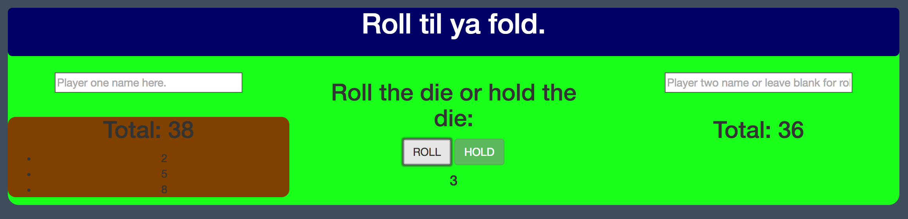

# Piggly Dice Gamification

#### Epicodus | 08.19.16
###### _By **Kyle Fisher** and **Peter Armington**_

## **//** Description

A front end app which simulates a game of pig dice. Players can continue to risk rolling a die or "holding" in an attempt to beat a competitor to 100 while avoiding rolling the number 1. For one to two players.

## **//** Installation Requirements/Instructions

1. Clone the repository found at https://github.com/FisherKyle/game.git
2. Open the file titled "index.html" in your web browser.

_Or_, using your web browser, navigate to the gh-page: https://fisherkyle.github.io/game/

## **//** Support and contact details

Contact kyle@kylefisher.com or peter.armington@gmail.com for more information.

## **//** Technologies Used

* HTML
* CSS
* Bootstrap
* JQuery
* Javascript

#### **//** **Specifications**
**___________________________________________________________**

* Two users go back and forth and, on their turn, click to roll the die, receiving a randomly generated number.
  * example input: player 1 clicks
  * example output: 4
* If the user rolls any number from 2-6, that number will be added to their turn total.
  * example input: player 1 has a 4 and rolls a 3.
  * example output: 4+3=7
* If the user rolls a one, their turn total will be reduced to 0, they will be alerted, and their turn ends.
  * example input: player 1 has a 7 and rolls a 1.
  * example output: "Sorry user, you rolled a 1. Your turn is over and you have added nothing to your total".
* When either player's number is equal to or greater than 100 upon holding, the winning player will be alerted.
  * example input: Player 2 has 94 and rolls a 7.
  * example output: "Congratulations, player 2, you've won!" will be displayed.

### License

Copyright (c) 2016 **Kyle Fisher, Peter Armington **//** www.kylefisher.com
